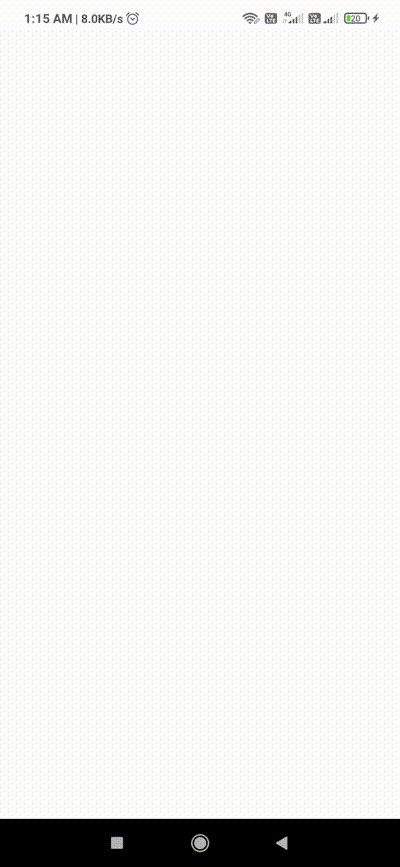

# Ionic-UI-Templates

It's built in **Ionic** + **Angular**.
 
You can also check my alternate and more complete version of this project in **React-Native** named as [React-Native-UI-Templates](https://github.com/Aashu-Dubey/React-Native-UI-Templates)

## Try The App

### Android

You can run app on Android following [these](ionic_ui_templates/README.md#running-locally) steps or download the latest APK [here](images/31-01-2022.apk).

### iOS

You need to build from source, See how to run on iOS [here](ionic_ui_templates/README.md#running-locally).

## Some Screenshots

