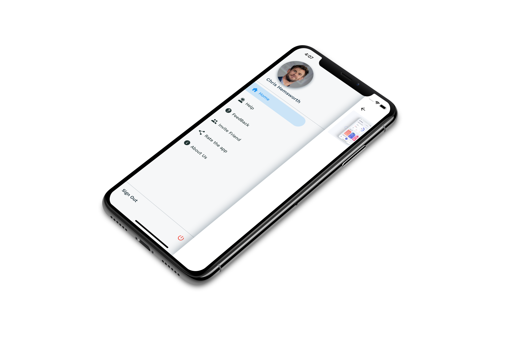

# Ionic UI Templates

This is Project's starting point.

<p align="center">
  
</p>

---

## 💪🏼 Getting Started

If this is your first **Ionic** project, Here are some resources to get you started:

- [Official Ionic documentation](https://ionicframework.com/docs)
- [List of some Ionic Tutorials and Courses](https://hackr.io/tutorials/learn-ionic)

## 🧑🏻‍💻 Running Locally

This project uses [Capacitor](https://capacitorjs.com), make sure you have required [Environment](https://ionicframework.com/docs/intro/environment) and [Ionic CLI](https://ionicframework.com/docs/intro/cli) setup.

follow below steps to run project locally

```bash
# clone the project and cd into it
git clone https://github.com/Aashu-Dubey/Ionic-UI-Templates.git
cd ./Ionic-UI-Templates/ionic_ui_templates

# install dependencies
npm install
```

### 🤖📱 Android

Make sure you have required native Android setup

```bash
# Sync to native project
ionic capacitor copy android

# Run Android
ionic capacitor run android
or Run 'ionic capacitor open android' and run through Android Studio
```

### 🍎📱 iOS

Make sure you have required native iOS setup.<br />
You don't really need to add an account to run on simulator.

```bash
# Sync to native project
ionic capacitor copy ios

# Run iOS
ionic capacitor run ios
or Run 'ionic capacitor open ios' and run through Xcode
```

### 🌐 Web

```bash
ionic serve
```