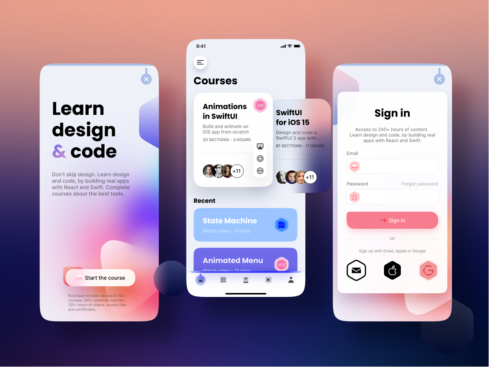

# Animated App with Rive and Ionic + Angular

An application with interactive UI and animations, with custom UI components like Bottom TabBar and SideBar, and using animated assets from [Rive](https://rive.app).

  

---

## 👀 This is how it looks

https://user-images.githubusercontent.com/46301285/214066940-2c29fb56-ef2a-4576-b50d-948ef25f4a1a.mp4

## 📦 Packages used

1. [ng-rive](https://github.com/dappsnation/ng-rive): To render and control the [Rive assets](../../../assets/course_rive/rive/).

## 🔤 Fonts used

1. [Inter-Regular.ttf](../../../assets/fonts/Inter-Regular.ttf)
2. [Inter-SemiBold](../../../assets/fonts/Inter-SemiBold.ttf)
3. [Poppins-Bold](../../../assets/fonts/Poppins-Bold.ttf)

## 🌻 Motivation

This app is a full Ionic + Angular replication of [this SwiftUI course](https://designcode.io/swiftui-rive-animated-app) by [@MengTo](https://twitter.com/MengTo).

## 🔗 Links

- [SwiftUI + Rive](https://designcode.io/swiftui-rive-animated-app): Original course in SwiftUI.
- [Flutter Rive](https://github.com/Aashu-Dubey/flutter-samples/tree/main/lib/rive_app): Flutter version for the same.
- [Twitter Post](https://twitter.com/aashudubey_ad/status/1617186151860948992)
